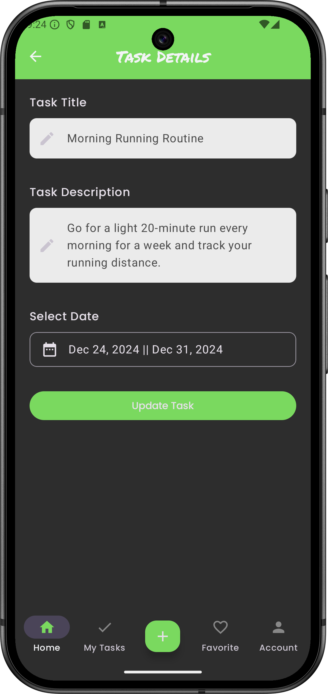

                           
## **TaskBox**  
Plan your tasks, goals, and activities within specific date ranges and make your life more organized! **TaskBox** is designed to enhance your productivity with its user-friendly interface and powerful features.  

---

## 📋 **Project Description**  
**TaskBox** is a task management application that allows users to plan and track their tasks within specific date ranges, update their completion status, and set priorities. Its flexible structure makes it suitable for both personal and professional use.  

### **Technologies and Features Used**  
- **Kotlin**  
- **MVVM**  
- **Jetpack Compose**  
- **Hilt**  
- **Room**  
- **LiveData**  
- **Navigation**  
- **Gson**  
- **Kotlin Coroutines**  
- **AndroidX**  
- **Multi-Language Support**  
- **Dark/Light Mode Support**  
- **Dynamic Color Adaptation**
